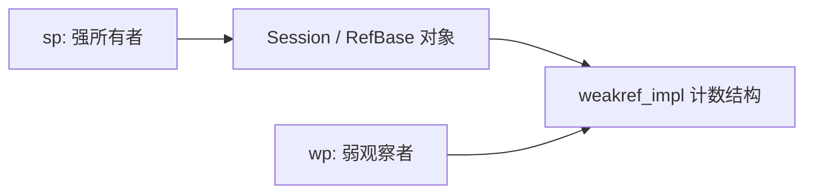

# Android RefBase、sp 与 wp：侵入式引用计数和对象生存期

`std::shared_ptr` 已经能管理共享对象，为什么 Android 源码里还到处都是 `sp<Surface>`、`wp<Layer>` 和 `RefBase`？因为 Framework Native 有一套历史悠久、与 Binder 等组件深度结合的侵入式引用计数协议。它不是标准库智能指针的另一种拼写：构造入口、弱引用、生命周期回调和对象销毁方式都有自己的规则。

本文以 **AOSP `android-16.0.0_r4`** 为源码基准。阅读前应理解析构、移动语义和标准库共享所有权；不需要先掌握 Binder 驱动。

## 1. 先拆开三个角色

| 角色 | 职责 | 不负责什么 |
| --- | --- | --- |
| `RefBase` | 让对象参与 Android 引用计数协议，连接计数数据与生命周期回调 | 不自动保护派生类的业务字段 |
| `sp<T>` | 持有强引用，拷贝增加强引用，销毁减少强引用 | 不代表独占访问，不保证远端进程存活 |
| `wp<T>` | 保存弱引用关系，尝试通过 `promote()` 获得强引用 | 不能直接作为可解引用的强所有者 |

“侵入式”的关键，是被管理类型主动参与协议：通常继承 `RefBase`，拥有访问引用计数实现的入口。不要据此推断所有计数都直接嵌在对象正文内；`RefBase` 内部关联的 `weakref_impl` 是单独的计数结构。

与 `shared_ptr` 不同，`sp<T>` 不是面对任意 `new T` 都能自由使用的通用工具。`T` 必须提供对应的引用计数操作；普通业务类如果没有这个协议，直接套上 `sp<T>` 并不会变成受管对象。

## 2. 创建、复制、移动和清空分别做什么

对正常的 `RefBase` 派生类型，优先使用：

```cpp
android::sp<Session> owner = android::sp<Session>::make();
android::sp<Session> another = owner;
android::sp<Session> transferred = std::move(another);
android::wp<Session> observer = owner;
```

这四行发生的事情不同：

1. `make()` 创建对象，并建立初始强引用。
2. 复制 `owner` 让另一个 `sp` 参与共同持有，不复制 `Session`。
3. 移动将句柄转移到 `transferred`，`another` 变空；没有必要先增加再减少同一份强计数。
4. 创建弱引用保存观察关系，不等于再创建一个普通强所有者。

`sp` 的析构、`clear()` 和重新赋值都可能减少旧对象的强引用。若这个动作释放了最后一个强所有者，析构就可能发生在当前线程、当前语句内部。因此“只是清空一个成员”可能触发复杂的析构链、锁操作甚至跨组件调用。

老代码里常见 `sp<Session> session = new Session;`。不要把这种历史写法作为新代码的默认模板：当前源码允许通过宏禁用隐式裸指针构造，`make()` 能更明确地表达受管创建。

## 3. 一个能观察完整生命周期的例子

下面是 **AOSP 平台环境示例**，依赖 `libutils`，不是只用桌面标准库即可编译的程序。

```cpp title="refbase_demo.cpp"
#include <utils/RefBase.h>

#include <iostream>
#include <utility>

class Session final : public android::RefBase {
public:
    Session() {
        std::cout << "construct\n";
    }

    ~Session() override {
        std::cout << "destroy\n";
    }

    void ping() const {
        std::cout << "ping\n";
    }

protected:
    void onFirstRef() override {
        std::cout << "first strong\n";
    }

    void onLastStrongRef(const void*) override {
        std::cout << "last strong\n";
    }
};

int main() {
    android::wp<Session> observer;
    {
        auto owner = android::sp<Session>::make();
        observer = owner;
        auto moved = std::move(owner);
        std::cout << std::boolalpha
                  << "source empty: " << (owner == nullptr) << '\n';

        if (auto locked = observer.promote(); locked != nullptr) {
            locked->ping();
        }

        moved.clear();
        std::cout << "strong owners released\n";
    }
    std::cout << "promotion failed: "
              << (observer.promote() == nullptr) << '\n';
    observer.clear();
}
```

对应的构建模块：

```bp
cc_binary {
    name: "cpp_notes_refbase",
    srcs: ["refbase_demo.cpp"],
    shared_libs: ["libutils"],
    cpp_std: "c++17",
}
```

默认强生命周期模式下，输出顺序应为：

```text
construct
first strong
source empty: true
ping
last strong
destroy
strong owners released
promotion failed: true
```

第一次 `promote()` 返回的临时强所有者在 `if` 作用域结束时销毁；随后 `moved.clear()` 才释放最后一份强引用。对象析构发生在打印 `strong owners released` **之前**，而不是等 `observer` 消失之后。

可以在 AOSP 产品构建环境中执行 `m cpp_notes_refbase`。设备执行还需要把产物放进允许执行的位置，并使用与产品匹配的库；这与普通 Linux 上 `g++ demo.cpp` 的环境不同。

## 4. 强对象与弱计数结构不是同一条寿命

默认模式可以抽象为：



最后一个强引用消失时，默认模式会析构业务对象；仍存在的弱引用让弱计数结构继续存在，从而能够安全回答“对象已经不能再提升”。

有两个容易混淆的细节：

- `weakref_impl` 存活不等于业务对象存活。
- 内部弱计数不一定等于源码中 `wp` 变量的数量，因为强引用协议本身也会参与弱计数维护。

所以不要拿 `getStrongCount()` 等调试计数来实现“只剩我一个人，因此可以无锁修改”的业务逻辑。即使计数读取本身可用，读取到执行之间也可能出现新的所有者；更重要的是，计数不描述裸借用者或字段同步关系。

## 5. 沿着 incStrong / decStrong 理解实现

源码入口是 `system/core/libutils/binder/RefBase.cpp`。阅读时先忽略调试记录，把关键路径归纳成以下动作：

### 5.1 增加强引用

`incStrong()` 先维护弱计数结构的存活，再增加强计数。对象刚创建时，内部强计数使用一个特殊初始值，而不是单纯的普通零值；首次强引用会完成这段状态转换，并触发 `onFirstRef()`。

这解释了为什么不能把实现机械地简化成“new 时计数是 0，每次加一”：实际协议还区分“尚未建立首个强引用”和“原来的强引用已经归零”。

### 5.2 减少强引用

`decStrong()` 减少强计数；当它发现自己释放的是最后一份强引用时，会执行相应的内存序协调，调用生命周期回调，并在默认模式下删除对象。之后还要释放此次强引用对应的弱计数责任。

源码中的原子操作保护的是这些计数转换。它们不意味着下面的代码线程安全：

```cpp
sharedSession->frameCount++;
```

多个线程持有不同 `sp<Session>`，只能保证它们共同引用的对象不会因为其他强所有者退出而提前析构；`frameCount` 的读写仍然需要锁、原子变量或线程约束。

## 6. promote 为什么不是“读裸指针再加一”

危险思路是先从某处取出对象地址，再对这个地址执行增加强计数。对象可能在这两个动作之间已经析构，此时连访问引用计数成员都是非法的。

`wp::promote()` 通过仍然有效的弱计数结构尝试建立强所有权。成功时返回的 `sp` 是后续访问对象的凭据，失败时返回空值：

```cpp
if (auto session = weakSession.promote(); session != nullptr) {
    session->ping();
}
```

必须在 `session` 的持有期间完成访问。不要提升后立即取出 `get()`，销毁 `sp`，再把裸指针投递到异步队列。

提升结果只回答本地对象的强所有权问题。若 `Session` 内部代表远端 Binder、关闭的文件或已经停止的服务，“对象还活着”和“业务操作能够成功”依然是两回事。

## 7. 扩展弱生命周期：不要套用 weak_ptr 的全部直觉

`RefBase` 提供 `extendObjectLifetime(OBJECT_LIFETIME_WEAK)`。在这个模式下，对象销毁不再简单地绑定到最后一个强引用：弱引用也可以参与延长对象本身的生命周期，强引用从零重新建立还可能经过 `onIncStrongAttempted()` 的协商。

这和默认 `std::weak_ptr` 的语义不同。标准库弱引用不会因为存在就阻止被管理对象析构；Android 的扩展模式改变的是对象销毁协议本身。

因此，读一个陌生类型的 `wp<T>` 时，先检查 `T` 的继承链和构造代码：

1. 是否调用了 `extendObjectLifetime`？
2. 是否覆写了 `onIncStrongAttempted`、`onLastStrongRef` 或 `onLastWeakRef`？
3. 它是否还维护驱动侧、缓存侧或外部协议的引用？

不要为了“让对象不容易死”随便启用扩展模式。它会让资源释放时机更复杂，还可能改变恢复强引用时的状态要求。

## 8. 生命周期回调不是任意业务初始化入口

`onFirstRef()` 在初始强引用建立时调用，但它不自动保证线程安全，也不解决构造期间对象过早暴露的问题。

`sp<T>::make()` 要先完成 `T` 的构造，再建立第一份强引用。因而在构造函数里把 `this` 当作“已经有强所有者的对象”传给 `sp<T>::fromExisting(this)`，前提通常不成立。

`fromExisting()` 的意义是：调用者已经能够证明这个裸地址对应活对象，而且已有强引用，再建立一个强持有者。它不是把悬空指针重新变安全的工具，也不是 `make()` 的替代品。

对 `onLastStrongRef()` 也不要只看名字：在弱提升的某些竞争路径中，源码会用它配平一次多余的引用获取。尤其在扩展弱生命周期类型中，不能未经分析就把它等同于“整个对象永远不会再被使用”的一次性业务关机事件。

回调执行时也不能假设持有某个业务锁。哪些线程可能释放最后一份强引用，哪些线程就可能进入这些回调。

## 9. 三种常见的所有权破坏

### 9.1 两套独立管理器管理同一个对象

不要这样做：

```cpp
auto owner = android::sp<Session>::make();
std::shared_ptr<Session> other(owner.get());
```

`other` 不知道 `RefBase` 的计数协议，会按自己的控制块决定何时 `delete`。两套管理器可能重复删除同一对象，或者在另一套仍认为对象存活时提前删除。

如果接口确实需要桥接，应设计一个持有 `sp` 的适配对象，而不是让两个管理器分别接管同一个裸地址。

### 9.2 给栈对象建立强引用

栈对象本应由作用域结束负责销毁。`sp` 的最后释放又可能执行 `delete`；两者冲突。受 `RefBase` 管理的对象应按其协议创建，不要把局部变量地址交给它接管。

### 9.3 用强引用表达所有反向关系

例如 `Manager` 强持有 `Session`，`Session` 又强持有 `Manager`，双方都无法自然降到零。若反向关系只是“通知管理者”，通常用 `wp<Manager>`，调用时提升；若必须保证管理者存活，则需要明确的 `close()` / 注销流程打破环。

弱引用不是万能修复：如果回调队列里的 Lambda 又捕获了强引用，环仍可能经由第三个对象闭合。画完整所有权图，比逐个替换指针有效。

## 10. 读源码时把智能指针翻译成契约

| 源码形态 | 首先追问 |
| --- | --- |
| `const sp<T>&` 参数 | 这里只借用句柄，还是函数内部会复制并长期保存？ |
| 返回 `sp<T>` | 返回后由谁共享对象？对象的业务状态是否已经关闭？ |
| 成员 `wp<T>` | 提升失败如何处理？是否持锁提升并调用外部代码？ |
| `sp<T>::fromExisting(this)` | 当前强引用保证来自哪里？是否处于构造/析构阶段？ |
| `mObject.clear()` | 是否可能在锁内触发最后析构？析构会不会反向调用？ |
| 手动 `incStrong/decStrong` | 引用配对跨越了哪条语言或协议边界？ |

例如 JNI 将 Native 地址保存成 Java `long` 时，那个整数本身不拥有 C++ 对象。必须另外有完整的引用建立和释放协议；仅看到 `reinterpret_cast<jlong>(object.get())`，不能认为对象就被 Java 保活了。

## 11. 源码入口与阅读顺序

以下路径均基于 `android-16.0.0_r4`，注意该版本的相关实现位于 `libutils/binder` 子目录：

1. [StrongPointer.h](https://android.googlesource.com/platform/system/core/+/refs/tags/android-16.0.0_r4/libutils/binder/include/utils/StrongPointer.h)：先看 `make`、复制/移动、`clear`。
2. [RefBase.h](https://android.googlesource.com/platform/system/core/+/refs/tags/android-16.0.0_r4/libutils/binder/include/utils/RefBase.h)：看生命周期模式、回调约定以及 `wp` 的操作。
3. [RefBase.cpp](https://android.googlesource.com/platform/system/core/+/refs/tags/android-16.0.0_r4/libutils/binder/RefBase.cpp)：追 `incStrong`、`decStrong`、`attemptIncStrong` 和 `decWeak`。
4. [BLASTBufferQueue JNI](https://android.googlesource.com/platform/frameworks/base/+/refs/tags/android-16.0.0_r4/core/jni/android_graphics_BLASTBufferQueue.cpp)：对照 `nativeCreate` 与 `nativeDestroy`，理解显式引用如何跨越 Java / Native 边界。

这些类的核心不是“怎样方便地写指针”，而是把 **谁保证存活、何时允许销毁、失败如何被观察** 变成可执行的协议。
