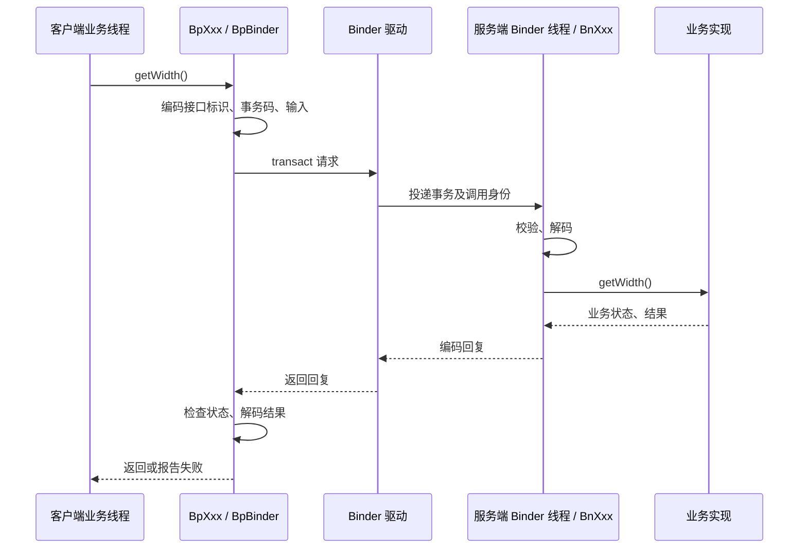

# Binder 与 Parcel：从一次 C++ 调用看清跨进程边界

Java 中写 `service.getState()` 看起来像普通方法调用，进入 Native 后却会遇到 `IBinder`、`BpBinder`、`BBinder`、`Parcel`、事务码和线程池。它们不是额外装饰：跨进程调用必须解决对象定位、数据编码、线程调度、调用身份以及对端死亡等问题。

本文以 **AOSP `android-16.0.0_r4`** 的平台 C++ Binder 为主线。下一篇讨论 AIDL NDK 生成代码；本篇先建立能同时解释 Java 和 Native 调用的模型。

## 1. 为什么不能直接调用另一个进程的对象

C++ 指针的意义依赖当前进程的虚拟地址空间。客户端的 `0x12340000` 在服务端可能没有映射，也可能对应完全不同的对象。把一个对象地址当整数写进消息，不会让对端拥有可调用的对象。

跨进程方法调用需要将“调用意图”转换成消息：

- 调用哪个 Binder 对象。
- 选择哪个操作，也就是事务码。
- 操作的输入数据，以及其中需要特殊传递的对象或文件描述符。
- 是否等待回复。
- 服务端执行后如何编码结果或错误。

Binder 为这些消息提供内核协调和对象引用语义。它不是把两个进程合并成共享 C++ 堆，也不是自动序列化任意对象内存。

## 2. 六个名字分别处在哪一层

| 名称 | 角色 |
| --- | --- |
| `IInterface` | 平台 C++ 中业务接口的公共基础 |
| `IBinder` | Binder 对象的抽象访问入口，提供事务等能力 |
| `BBinder` | 当前进程内可接收事务的 Binder 实体基础 |
| `BpBinder` | 代表远端 Binder 的本地代理，关联进程内句柄 |
| `BnXxx` | 业务接口的服务端分发层，把事务解码成方法调用 |
| `BpXxx` | 业务接口的客户端代理层，把方法参数编码成事务 |

最容易混淆的是 `BpXxx` 与 `BpBinder`：前者理解业务方法和参数协议，后者提供通用 Binder 传输能力。服务端的 `BnXxx` 与 `BBinder` 也存在类似分层。

`BpInterface<T>` 和 `BnInterface<T>` 是帮助组合这些能力的模板，不是每次调用都要经过的一种额外 IPC。

## 3. 一次远程同步调用的完整过程

假设接口有 `getWidth()`，忽略生成器具体命名，远程路径可以画成：



同步意味着调用者等待这次事务的回复；并不意味着整个服务端只有一个线程，也不意味着等待期间永远不会发生嵌套 Binder 调用。

若服务端拿到请求后只是投递一个任务就立即回复，客户端返回只能说明“服务端接受了投递”，不代表后台任务已经完成。接口语义必须明确回复对应的是哪个完成点。

## 4. 本地接口短路：同一行代码可能不是 IPC

`IInterface.h` 中的 `asInterface` 类逻辑会先尝试查询本地接口；如果 Binder 对象就在当前进程，并能匹配接口，可能直接返回本地业务接口，而不是创建远程代理。

这会改变可观察行为：

| 维度 | 本地直接调用 | 远程调用 |
| --- | --- | --- |
| 执行线程 | 通常就是调用者线程 | 通常由服务端 Binder 调度执行 |
| 参数 | 直接遵循 C++ 参数传递规则 | 必须编码和解码 |
| 故障 | 普通本地逻辑问题 | 还可能有事务失败、对端死亡 |
| `oneway` | 直接调用不因声明自动变成异步 | 通过 Binder 提交异步事务 |
| 调用身份 | 不能凭“调用了接口”推断建立新远程身份 | Binder 为事务提供调用身份 |

这里说的是“查询到本地接口后的直接方法调用”；若代码主动调用本地 `BBinder::transact`，仍会走本地事务分发，但没有远程驱动往返。

因此测试服务不能只在同进程跑。否则可能漏掉序列化错误、线程安全问题和异步时序问题。

## 5. Parcel 是有读写协议的容器，不是对象快照

`Parcel` 保存按顺序编码的数据，同时管理 Binder 对象、FD 等需要特殊处理的内容。读写两端必须对类型、顺序和可空性达成一致。

例如协议是：

```text
请求：int32 width → int32 height
回复：业务状态 → int64 area
```

服务端不能先读取 `height` 再读取 `width`，也不能把两个 `int32` 当成一个 `int64` 来解释。即使底层字节数碰巧够用，语义仍然错了。

下面用平台 `Parcel` 做一个不经过驱动的编码实验：

```cpp title="parcel_demo.cpp"
#include <binder/Parcel.h>
#include <utils/Errors.h>

#include <cstdint>
#include <iostream>

int main() {
    android::Parcel parcel;
    if (parcel.writeInt32(1080) != android::OK ||
        parcel.writeInt32(2400) != android::OK) {
        std::cerr << "write failed\n";
        return 1;
    }

    parcel.setDataPosition(0);

    std::int32_t width = 0;
    std::int32_t height = 0;
    if (parcel.readInt32(&width) != android::OK ||
        parcel.readInt32(&height) != android::OK) {
        std::cerr << "read failed\n";
        return 1;
    }

    if (width <= 0 || height <= 0 || parcel.dataAvail() != 0) {
        std::cerr << "invalid payload\n";
        return 1;
    }

    const std::int64_t area = static_cast<std::int64_t>(width) * height;
    std::cout << width << " x " << height << " = " << area << '\n';
}
```

对应构建模块：

```bp
cc_binary {
    name: "cpp_notes_parcel",
    srcs: ["parcel_demo.cpp"],
    shared_libs: ["libbinder", "libutils"],
    cpp_std: "c++17",
}
```

预期输出：

```text
1080 x 2400 = 2592000
```

`setDataPosition(0)` 把读写位置移回开头；不会自动将任意数据变成合法协议。先转换成 `int64_t` 再相乘，是为了让乘法本身使用更宽的类型，而不是在 `int32` 溢出后才转换。

这个实验验证的是 `Parcel` 的读写方式，不是 Binder IPC。真正的客户端还需要接口标识、事务码、传输状态和业务状态协议，通常应交给 AIDL 生成。

## 6. Binder 对象与 FD 不是普通整数

写入 Binder 引用时，传递的是可被 Binder 系统识别和转换的对象引用。服务端进程的本地对象可在客户端表现为代理；驱动维护相应关系，而不是把服务端的 `this` 地址直接交给客户端解引用。

传递 FD 时，接收进程得到的是它自己描述符表中的有效描述符，**数值不必与发送端相同**。两边通常引用同一个底层打开文件描述，因此某些状态可能共享；关闭一边的 FD 不等于立即撤销另一边已经拥有的引用。

读 FD 时还要看 API 的所有权契约：

- 返回的 FD 是否只在 `Parcel` 存活期间有效？
- API 是否已经转移了一份独立所有权？
- 若业务需要长期保存，是否要复制并用 `unique_fd` 管理？

不要看到返回类型为 `int` 就猜测是否需要 `close`。整数表达的是句柄数值，所有权仍然来自具体 API 协议。

## 7. 必须分清三层错误

| 层次 | 示例 | 处理方式 |
| --- | --- | --- |
| 传输 / 框架错误 | 死亡对象、未知事务、事务失败、解码失败 | 判断连接和协议是否还能使用 |
| 服务声明的错误 | 参数非法、权限不足、服务特定错误码 | 按接口契约向调用者报告 |
| 正常业务结果 | 查不到记录、集合为空、状态为停止 | 不应默认当作传输失败 |

平台 C++ 常见 `status_t`，AIDL C++ 常见 `binder::Status`，AIDL NDK 常见 `ndk::ScopedAStatus`。不同层的类型不能仅凭“都包含一个整数”就互相替换。

特别是一次非幂等操作，例如“扣减一次额度”：客户端发现连接出错，并不能总是知道服务端是在执行前死亡，还是执行后、发送回复前死亡。直接重试可能重复执行。正确设计可能需要请求 ID、去重记录、幂等接口或结果查询。

Binder 提供事务传输，不替业务提供“任何故障下恰好执行一次”的保证。

## 8. 线程池、重入与 oneway 的真实含义

服务端可能同时处理多个客户端、多个 Binder 对象的请求。不要因为接口来自 Binder 就省略成员数据的同步。

同步调用还有重入问题：线程 A 持锁调用远端，远端处理期间又回调 A 所在进程；嵌套调用可能进入原线程或其他可用线程，具体取决于调用链与 Binder 调度。于是可能出现：

```text
本地持有 mutex
    → 同步调用远端
        → 远端回调本地
            → 本地再次请求同一个 mutex
```

非递归锁可能死锁；改成递归锁也未必正确，因为回调可能观察到尚未恢复的不变量。更可靠的设计是：锁内更新并取得必要快照，锁外调用外部代码，必要时回来核对状态版本。

`oneway` 表示远程调用不等待服务端方法执行完毕并返回业务回复，但它不是无限容量队列：

- 提交仍可能遇到本地或传输层问题。
- 同一 Binder 节点的远程异步事务有串行化约束，不能靠增加线程池解决所有积压。
- 不同节点或混合同步事务，不能推断出统一的全局顺序。
- 没有方法回复，就必须另外设计业务完成通知和失败反馈。
- 本地直接方法调用不自动获得异步线程。

这些边界在“通知监听者”“每帧回调”“状态频繁更新”场景里尤其重要。

## 9. 远端死亡与本地对象存活是两回事

客户端可能仍持有一个非空的 `sp<IBinder>`，但对端进程已经退出。该强引用保证本地代理对象的生命周期，不保证远端业务持续可用。

`linkToDeath` / death recipient 用于观察远端死亡，但要把它视为并发事件：

1. 注册和正常调用之间，对端可能已经死亡。
2. 死亡通知到达时，业务线程可能仍在处理上一轮失败。
3. 清理逻辑需要防止重复执行，并避免在持锁状态下调用未知外部代码。
4. 如果服务重启，新拿到的 Binder 不一定是原来的逻辑会话，订阅和缓存可能需要重建。

“调用前检查存活”不能取代对这次调用错误的处理。检查结束到真正调用之间，仍然存在时间窗口。

## 10. 安全边界：接口标识不是权限认证

接口 token 用来确认请求符合目标接口协议，但客户端知道接口名并不代表拥有调用权限。服务端还要结合可信调用身份、平台权限、SELinux 和业务授权进行检查。

不能相信请求体里自己填写的 `uid`；它只是客户端输入。需要调用者身份时，应使用 Binder 提供的事务上下文，并考虑 `clearCallingIdentity` 一类操作是否改变了上下文。

尤其要小心异步投递：Binder 方法将任务放到工作线程后，工作线程读取“当前调用 UID”，通常得不到原请求的有效调用身份。应在入口完成授权，或者保存后续验证真正需要的可信信息，而不是稍后猜测。

解析数据同样属于安全边界：长度、数值范围、可空性、枚举值和 FD 权限都需要检查。生成代码解决线格式，不替代业务验证。

## 11. 大数据为什么不应直接塞进 Parcel

Binder 的事务缓冲空间是受限的，而且会受到进程内并发事务影响。不能把“单次小于某个经验大小”理解为必定成功的保证。

大图像、视频帧或持续的数据流通常需要共享内存、图形缓冲区、文件描述符等机制，再通过 Binder 传递元数据、访问句柄和同步信息。这样仍需考虑：

- 谁负责分配与释放共享资源。
- 数据是否允许同时修改。
- 接收方何时可以开始读取。
- 发送方何时可以复用原来的内存。

Binder 帮助传递控制信息，但不会自动解决共享数据的同步问题。图形栈中的 fence 正是在处理后两类时间关系。

## 12. 怎样读源码而不陷入驱动细节

建议先完成一条可闭合的调用链，而不是从驱动文件第一行读起：

1. 找接口定义，记录方法、参数、是否 `oneway`。
2. 找客户端代理，确认事务码、编码顺序和错误处理。
3. 沿 `BpBinder::transact` 进入 `IPCThreadState::transact`。
4. 看 `waitForResponse` 如何等待并处理驱动命令。
5. 在服务端找 `executeCommand` 接收事务后的分发。
6. 回到 `BnXxx` 或生成的事务分发函数，确认最终调用哪个实现。
7. 沿回复路径区分业务状态与返回值。

源码基准入口：

- [IInterface.h](https://android.googlesource.com/platform/frameworks/native/+/refs/tags/android-16.0.0_r4/libs/binder/include/binder/IInterface.h)：本地接口查询以及 Bp / Bn 模板；该版本也明确约束新增手写接口。
- [BpBinder.cpp](https://android.googlesource.com/platform/frameworks/native/+/refs/tags/android-16.0.0_r4/libs/binder/BpBinder.cpp)：通用远端对象代理。
- [IPCThreadState.cpp](https://android.googlesource.com/platform/frameworks/native/+/refs/tags/android-16.0.0_r4/libs/binder/IPCThreadState.cpp)：线程与驱动交互、等待和事务处理。
- [Parcel.h](https://android.googlesource.com/platform/frameworks/native/+/refs/tags/android-16.0.0_r4/libs/binder/include/binder/Parcel.h)：读写接口及所有权约定。
- [Binder 线程模型](https://source.android.com/docs/core/architecture/ipc/binder-threading)：结合时序图理解同步、异步和重入。

读通这一条链之后，再深入驱动中的节点、句柄和事务队列，才能始终知道底层机制在服务哪个上层语义。
