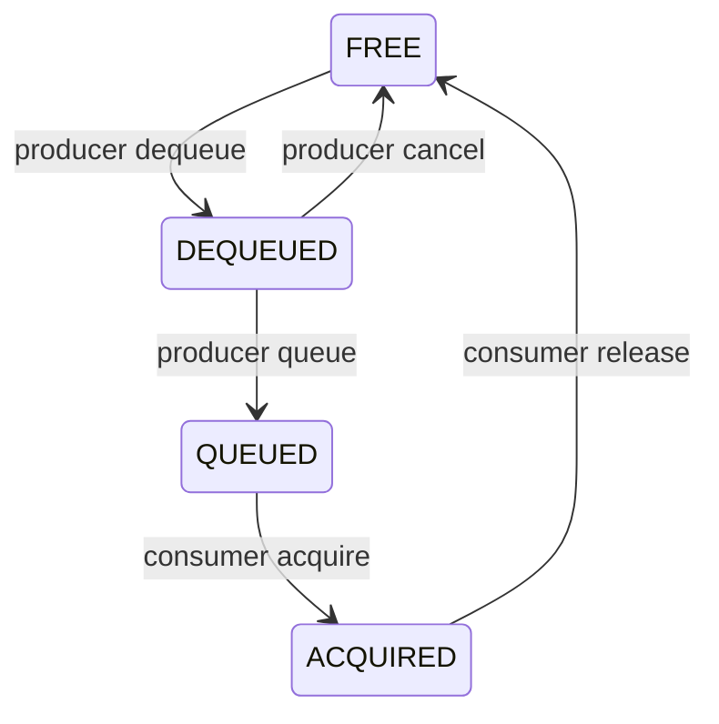
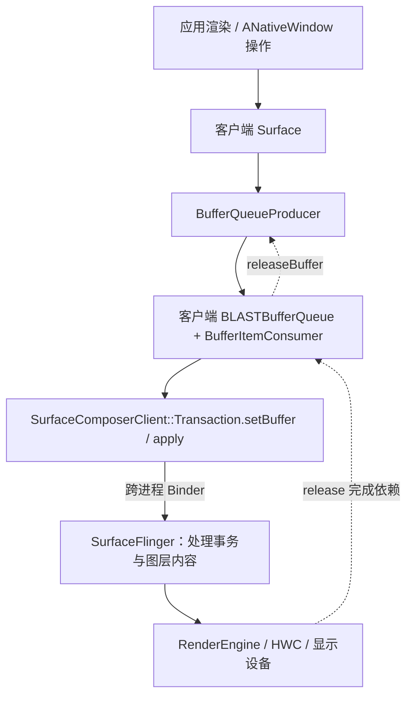

# BufferQueue 与 SurfaceFlinger：缓冲区所有权、Fence 和 BLAST 调用链

图形源码最容易读成类名接龙：`Surface` 调 `BufferQueue`，再到 `SurfaceFlinger`。如果没有分清“对象还活着”“谁有权操作缓冲区”“GPU 是否完成访问”，知道再多函数名也解释不了黑屏、卡顿和缓冲区耗尽。

本文以 **AOSP `android-16.0.0_r4`** 为基准，重点分析普通窗口相关的 BLAST 路径。图形消费者并不只有 SurfaceFlinger，不同版本、窗口类型和渲染 API 的细节也不同；不要把一张简图当作所有场景的固定拓扑。

## 1. 三条彼此独立的生命周期

先把一个 `GraphicBuffer` 放在三种语境下：

| 层次 | 回答的问题 | 常见机制 |
| --- | --- | --- |
| C++ 对象生命周期 | 描述缓冲区的对象还能否访问？ | `sp<GraphicBuffer>` 等引用 |
| 队列所有权 | 生产者或消费者现在是否有权使用这个槽位？ | dequeue / queue / acquire / release |
| 硬件访问完成时间 | GPU、显示硬件是否已经完成之前的读写？ | acquire / release fence |

强引用非空，只保证相关 C++ 对象按协议存活；它不自动授予槽位写权限。拿到可用槽位，也不一定意味着上一轮硬件访问已结束。

这正是前面几篇知识的交汇点：智能指针处理对象寿命，锁处理 CPU 共享状态，fence 处理异步硬件工作的完成依赖。三者不能互相代替。

## 2. Surface、SurfaceControl、GraphicBuffer 分别是什么

| 对象 | 更合适的理解 |
| --- | --- |
| `Surface` | 面向生产者的缓冲区提交入口，Native 层对接 `ANativeWindow` 操作 |
| `SurfaceControl` | 操纵合成层及相关状态的控制句柄 |
| `GraphicBuffer` | 图形缓冲区的描述与底层分配句柄包装，不是简单的 `vector<byte>` |
| `BufferQueueProducer` | 提供生产者申请、提交、取消缓冲区的协议 |
| `BufferQueueConsumer` | 提供消费者获取、释放缓冲区的协议 |
| `BLASTBufferQueue` | 把 BufferQueue 消费结果组织进 SurfaceControl 事务的桥接组件 |
| `SurfaceFlinger` | 处理图层与显示合成，协调 RenderEngine、HWC 等下游 |

“有一个 `Surface`”不等于“有一块固定的像素数组”。随着尺寸、格式、usage 等条件变化，底层缓冲区可能重分配；同一生产者也会轮转使用多个槽位。

同样，`SurfaceControl` 的控制状态与 `Surface` 提交的内容有关联，但它们不是同一个概念。窗口位置更新、裁剪变化和新图像内容可以在事务中协调，却不应在脑中合并成“一个对象的一次赋值”。

## 3. BufferQueue 不是把整帧像素反复拷贝进队列

队列主要管理缓冲区槽位、句柄、帧元数据和同步信息。像素存放在图形分配得到的底层内存中；跨组件或跨进程传递时，通常共享底层分配的访问句柄，而不是把整张图当普通 `Parcel` 字节数组复制。

要分清几个常见标识：

- **slot**：当前队列中的槽位索引。
- **buffer ID**：帮助标识某个实际缓冲区对象或分配。
- **frame number**：区分该生产者提交的不同帧。
- **transaction / vsync 标识**：关联状态提交与调度时序。

同一 slot 可以先后承载不同分配；同一缓冲区也可以在不同帧反复使用。因此日志只打印 slot，很可能不足以判断“是不是同一帧”。

[BufferQueue 与 Gralloc 概览](https://source.android.com/docs/core/graphics/arch-bq-gralloc) 可以帮助建立组件关系；具体字段和状态限制应回到对应版本源码确认。

## 4. 普通非共享模式的四种槽位状态

先只讨论普通模式，不把 shared-buffer 等特殊模式混进来：



| 状态 | 核心含义 |
| --- | --- |
| `FREE` | 不由生产者 dequeue 持有，也不在消费者 acquired 集合中，可参与复用选择 |
| `DEQUEUED` | 已交给生产者，生产者负责正确使用并 queue 或 cancel |
| `QUEUED` | 已提交，等待消费者按规则获取 |
| `ACQUIRED` | 已交给消费者，尚未通过 release 归还 |

这张图描述所有权主干，不是实现的全部转移：真实代码还有丢弃旧帧、连接断开、attach / detach、共享模式及错误恢复等路径。

也不要把“BufferQueue 通常用三缓冲”理解为常量规则。可 dequeue 数、最大 acquired 数、异步模式和消费者需求共同影响可用槽位与阻塞行为；分析问题要看运行时配置。

## 5. Fence：权限到了，数据不一定已经就绪

生产者调用 `queueBuffer` 时，GPU 可能还在绘制这一帧。它可以把表示绘制完成的 fence 随缓冲区一起交出去；消费者获得缓冲区后，要在真正读取数据前尊重这个依赖。

反方向也一样：消费者调用 `releaseBuffer` 时，显示硬件或 GPU 可能还在读取旧内容。归还时携带的 release fence 告诉下一轮生产者，什么时候可以覆盖这块内存。

因此：

```text
queue 返回 ≠ GPU 绘制完成
acquire 成功 ≠ 此刻可以无条件读取
release 调用 ≠ 硬件已经停止读取
FREE 状态 ≠ 对应 release fence 一定已经 signal
```

“等待”不一定由 CPU 阻塞完成。渲染系统可以把 fence 作为依赖提交给 GPU 或下游，让 CPU 继续安排其他工作；核心要求是后续访问必须被正确排序。

`Fence::NO_FENCE` 通常表达没有需要等待的 fence 依赖。它不是“随便跳过一个尚未完成的有效 fence”的许可证。FD 的复制、转交和关闭，还需要独立遵循所有权约定。

## 6. 一个可运行的模型：区分状态与完成时间

下面用单槽位、单线程程序模拟协议。布尔值只代表“完成条件”，**不是 Android fence 实现，也不具备线程同步能力**。模型允许拿到所有权后仍因依赖未完成而拒绝读写，用来暴露错误直觉。

```cpp title="slot_protocol.cpp"
#include <iostream>
#include <stdexcept>

enum class SlotState {
    Free,
    Dequeued,
    Queued,
    Acquired,
};

class Slot {
public:
    void dequeue() {
        require(SlotState::Free);
        state_ = SlotState::Dequeued;
    }

    void write(int value) {
        require(SlotState::Dequeued);
        if (!consumerDone_) {
            throw std::logic_error("consumer work incomplete");
        }
        value_ = value;
    }

    void queue(bool producerDone) {
        require(SlotState::Dequeued);
        producerDone_ = producerDone;
        state_ = SlotState::Queued;
    }

    void acquire() {
        require(SlotState::Queued);
        state_ = SlotState::Acquired;
    }

    int read() const {
        require(SlotState::Acquired);
        if (!producerDone_) {
            throw std::logic_error("producer work incomplete");
        }
        return value_;
    }

    void release(bool consumerDone) {
        require(SlotState::Acquired);
        consumerDone_ = consumerDone;
        state_ = SlotState::Free;
    }

    void signalProducer() {
        producerDone_ = true;
    }

    void signalConsumer() {
        consumerDone_ = true;
    }

private:
    void require(SlotState expected) const {
        if (state_ != expected) {
            throw std::logic_error("invalid slot transition");
        }
    }

    SlotState state_ = SlotState::Free;
    bool producerDone_ = true;
    bool consumerDone_ = true;
    int value_ = 0;
};

int main() {
    Slot slot;
    slot.dequeue();
    slot.write(42);
    slot.queue(false);
    slot.acquire();

    try {
        static_cast<void>(slot.read());
    } catch (const std::logic_error& error) {
        std::cout << error.what() << '\n';
    }

    slot.signalProducer();
    std::cout << "frame=" << slot.read() << '\n';
    slot.release(false);

    slot.dequeue();
    try {
        slot.write(99);
    } catch (const std::logic_error& error) {
        std::cout << error.what() << '\n';
    }

    slot.signalConsumer();
    slot.write(99);
    slot.queue(true);
    slot.acquire();
    std::cout << "frame=" << slot.read() << '\n';
    slot.release(true);
}
```

编译与输出：

```bash
g++ -std=c++17 -Wall -Wextra -Wpedantic slot_protocol.cpp -o slot_protocol
./slot_protocol
```

```text
producer work incomplete
frame=42
consumer work incomplete
frame=99
```

第一处失败发生在 `ACQUIRED` 状态，说明消费者已经拿到槽位，但不能忽略生产者工作完成条件。第二处发生在 `DEQUEUED` 状态，说明生产者拿回槽位后，仍不能立刻覆盖上一轮消费者正在使用的内容。

真实系统还要支持多个槽位、异步信号、帧丢弃、超时和连接断开；这个模型只提取“所有权与完成时间独立”的不变量，不能直接替换任何 AOSP 类。

## 7. Android 16 的 BLAST 路径不能画成旧版直连

对普通窗口的一条典型路径，可以这样分层：



关键变化是：**BLAST 使用的 BufferQueue 消费端可以位于客户端一侧，再把取得的缓冲区作为事务内容提交给 SurfaceFlinger。** 不能一律说“Surface 的 queueBuffer 通过 Binder 直接进入 SurfaceFlinger 中的 BufferQueueConsumer”。

图中“客户端”表示相对 SurfaceFlinger 的提交方；具体对象驻留哪个进程仍要从创建代码验证。Camera、MediaCodec、SurfaceTexture 等场景有不同消费者，不能照搬普通窗口链路。

## 8. 沿 Surface 追生产者一侧

从 `frameworks/native/libs/gui/Surface.cpp` 开始，先抓住两个方向：

**申请缓冲区：**

```text
ANativeWindow dequeue 钩子
    → Surface::dequeueBuffer
    → IGraphicBufferProducer::dequeueBuffer
    → BufferQueueProducer 对槽位与分配的处理
```

`Surface` 不只是简单转发。它还管理客户端缓存、槽位与 `GraphicBuffer` 的对应关系，并处理需要重新请求缓冲区的情况。尺寸等条件变化后，旧缓存不能不加判断地继续使用。

**提交缓冲区：**

```text
ANativeWindow queue 钩子
    → Surface::queueBuffer
    → IGraphicBufferProducer::queueBuffer
    → 更新队列状态并通知消费者
```

这里要记录返回状态和回调时机。渲染 API 表面的 `eglSwapBuffers` 等操作，会通过相应实现与 NativeWindow 协作，但不要假设所有渲染 API 都有完全相同的内部调用栈。

## 9. 沿 BLAST 看 acquire 如何变成事务

在 `BLASTBufferQueue.cpp` 中，`onFrameAvailable` 与 `acquireNextBufferLocked` 是重要入口。后者的主干不是“直接显示”，而是：

1. 检查是否有待处理帧、acquired 数量是否允许继续，以及目标 `SurfaceControl` 是否存在。
2. 通过 `BufferItemConsumer` 获取 `BufferItem`。
3. 检查缓冲区有效性、尺寸与接收条件；某些帧会被拒绝或延后。
4. 记录已提交缓冲区与帧信息，建立后续释放匹配关系。
5. 将 `GraphicBuffer`、生产者完成 fence、帧号和 release callback 放入 `Transaction::setBuffer`。
6. 附带 dataspace、裁剪、变换、损伤区域和时间线等元数据。
7. 合并必要事务，并在对应路径调用 `apply`，或者交给外部事务统一提交。

`acquireNextBufferLocked` 名字中的 `Locked` 是阅读线索，而不是 C++ 自动执行的语法。要检查调用者持有什么锁，哪些回调会反向进入对象，以及返回前是否已经改变计数。

`Transaction::apply` 返回也不能简单等同于该帧已经显示。接收事务、应用状态、选择缓冲区进行合成、硬件呈现和旧缓冲区可复用，是不同时间点；同步选项和回调各自只承诺其定义的完成点。

## 10. SurfaceFlinger 如何继续处理这帧

`SurfaceComposerClient::Transaction` 将客户端收集的层状态提交给 SurfaceFlinger。服务端根据事务与调度状态更新相应图层，决定何时选取新内容参与合成。

概念上需要区分：

- **事务就绪**：相关状态及依赖是否满足处理要求。
- **latch / 内容选择**：本轮合成使用哪一帧内容。
- **composition**：由 HWC 直接处理哪些层，哪些内容需要 RenderEngine 参与。
- **present**：将最终结果提交到显示链路。
- **release**：旧缓冲区在何时不再被相关下游使用。

实际实现可能把这些步骤分散在多个类和调度阶段。分析当前分支时，应搜索行为对应的入口，而不是要求所有版本都存在某个博客里的旧类名。

release fence 与 present fence 也不能随意互换：前者主要回答特定缓冲区何时可以复用，后者与显示提交完成时序相关。它们关联的对象和承诺不同。

## 11. 用一帧的时间线解释卡顿

假设一帧经历：

```text
dequeue → CPU 准备命令 → GPU 绘制 → queue / acquire
        → 事务处理 → 合成 → 呈现 → 释放可复用
```

这是观察维度，不是要求 CPU 严格顺序等待每个阶段完成；GPU 工作与 CPU 提交、消费端获取之间可以重叠，fence 负责维护必要依赖。

| 表现 | 优先区分的原因 | 有价值的证据 |
| --- | --- | --- |
| dequeue 等很久 | 缓冲区都被占用，或下游释放慢 | 槽位状态、acquired 数、release 时间 |
| queue 已完成但没新画面 | 事务尚未处理、帧被拒绝、层不可见或依赖未就绪 | frame number、层状态、事务与 fence |
| GPU 很忙 | 生产或合成工作超出预算 | GPU 时间、acquire fence signal 时间 |
| resize 时拉伸或黑帧 | 内容尺寸与层状态更新不同步 | 缓冲区尺寸、crop、transform、事务配对 |
| 占用持续增长 | acquired 未归还、回调丢配、对象或句柄泄漏 | 提交 / release 配对、引用与 FD 数 |

“多加一个缓冲区”可能降低部分生产者阻塞，却增加排队延迟，也可能只是延后暴露未释放问题。修复前先定位阻塞在哪种资源和哪个时间条件上。

取证时可以结合设备支持的 Perfetto 图形 / 调度数据，以及 `adb shell dumpsys SurfaceFlinger`。具体字段和追踪开关随产品变化；不要仅凭一张瞬时 dumpsys 就推断整个帧生命周期。

## 12. 把前面的 C++ 知识应用到真实图形代码

遇到 `sp<GraphicBuffer>`，问的是谁持有对象，不是这块像素能否立刻覆盖。

遇到 `unique_fd` 或 `sp<Fence>`，分别确认句柄所有权与等待语义；复制句柄不会让硬件任务立即完成。

遇到释放回调 Lambda，沿捕获列表判断是否强持有队列，是否可能形成环，回调在哪个线程执行以及断开连接后如何处理。

遇到 `std::mutex` 和 `Locked` 后缀，检查锁保护的不变量，尤其是 available、acquired、submitted 之间的计数关系。原子引用计数不会替它们加锁。

遇到 `Transaction&` 返回值，识别链式调用是在修改同一个事务对象；真正跨进程提交通常发生在后续 `apply` 一类入口，而不是每个 setter 都立即完成一次独立显示更新。

## 13. 源码入口与阅读顺序

以下源码链接固定在 `android-16.0.0_r4`：

1. [BufferSlot.h](https://android.googlesource.com/platform/frameworks/native/+/refs/tags/android-16.0.0_r4/libs/gui/include/gui/BufferSlot.h)：状态、缓冲区和 fence 的关系；该文件中的 `BufferState` 同时解释普通状态与共享模式。
2. [BufferQueueProducer.cpp](https://android.googlesource.com/platform/frameworks/native/+/refs/tags/android-16.0.0_r4/libs/gui/BufferQueueProducer.cpp) 与 [BufferQueueConsumer.cpp](https://android.googlesource.com/platform/frameworks/native/+/refs/tags/android-16.0.0_r4/libs/gui/BufferQueueConsumer.cpp)：对照 dequeue / queue / acquire / release。
3. [Surface.cpp](https://android.googlesource.com/platform/frameworks/native/+/refs/tags/android-16.0.0_r4/libs/gui/Surface.cpp)：NativeWindow 与生产者接口之间的适配。
4. [BLASTBufferQueue.cpp](https://android.googlesource.com/platform/frameworks/native/+/refs/tags/android-16.0.0_r4/libs/gui/BLASTBufferQueue.cpp)：获取缓冲区、组装事务、跟踪释放。
5. [SurfaceComposerClient.cpp](https://android.googlesource.com/platform/frameworks/native/+/refs/tags/android-16.0.0_r4/libs/gui/SurfaceComposerClient.cpp)：`setBuffer` 和事务提交。
6. [SurfaceFlinger.cpp](https://android.googlesource.com/platform/frameworks/native/+/refs/tags/android-16.0.0_r4/services/surfaceflinger/SurfaceFlinger.cpp)：从事务入口追到图层更新与合成调度。
7. [Android 同步框架](https://source.android.com/docs/core/graphics/sync)：对照 fence 的跨组件同步角色。

阅读时选定一帧，持续记录 **进程、线程、对象所有者、槽位状态、帧标识、fence 依赖和错误返回**。这张记录表，比背诵一串类名更接近真正理解图形系统。
