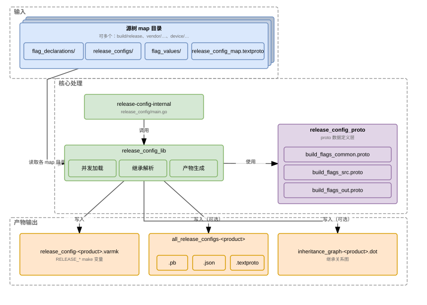
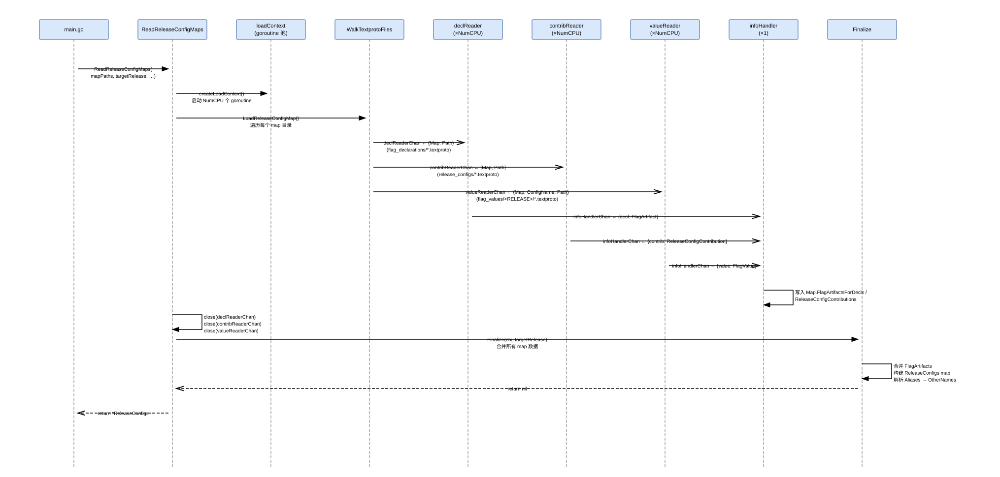
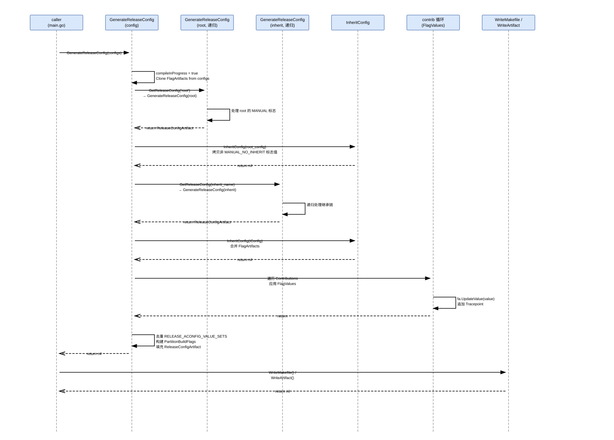
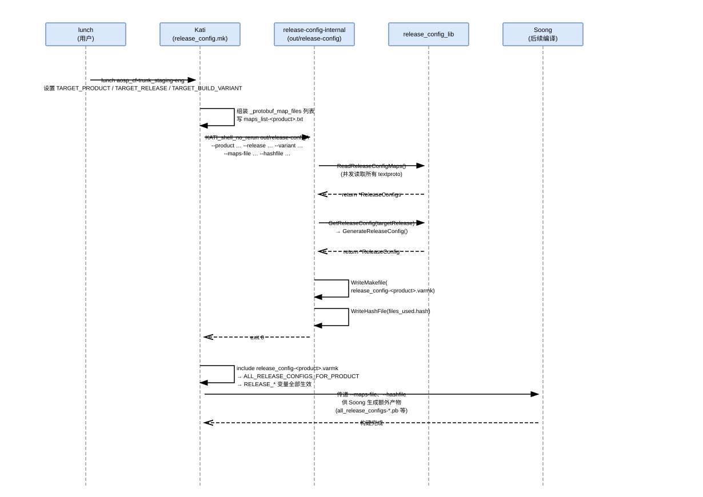

# release_config

> 本文基于 Android 16.0.0 r4（android-16.0.0_r4 tag，本地检出 `/home/mao/code/android-16.0.0_r4`）。

## 目录

- 一、概述
  - 1.1 解决的问题
  - 1.2 源码与数据布局
- 二、整体架构
  - 2.1 组件构成与数据流
  - 2.2 构建集成：Android.bp 产物
- 三、核心数据结构
  - 3.1 Workflow 枚举
  - 3.2 FlagDeclaration 与 Value
  - 3.3 ReleaseConfigMap
  - 3.4 FlagArtifact 与 Tracepoint
  - 3.5 ReleaseConfigArtifact
  - 3.6 FlagArtifact（Go 运行时结构）
  - 3.7 ReleaseConfig（Go 运行时结构）
- 四、子模块详解
  - 4.1 release_config_proto — proto 定义层
  - 4.2 release_config_lib — 核心库
    - 4.2.1 并发加载器
    - 4.2.2 Finalize：合并与校验
    - 4.2.3 GenerateReleaseConfig：继承解析
    - 4.2.4 WriteMakefile 与输出序列化
  - 4.3 release-config-internal — 主 CLI
  - 4.4 build_flag — 交互式标志工具
  - 4.5 build_flag_declarations — 声明汇总工具
  - 4.6 release_config_contributions — 贡献目录枚举工具
  - 4.7 product_configs — 跨产品批量工具
- 五、关键流程
  - 5.1 编译期完整时序
- 六、配置与使用
  - 6.1 入口：release_config.mk 的调用
  - 6.2 release-config-internal CLI 参数
  - 6.3 源树文件布局
- 七、调试工具
  - 7.1 查询标志取值
  - 7.2 追踪赋值来源
  - 7.3 写入标志值
  - 7.4 产物文件检查
  - 7.5 继承关系图
- 八、参考文档

---

## 一、概述

### 1.1 解决的问题

Android 每个发布版本（trunk_staging、trunk、ap3a、ap4a 等）需要一套一致的构建标志（build flags）。
在 `release_config` 之前这些标志分散在 make 文件里、靠手工维护。`release_config` 用 textproto
文件取代旧的 make 文件，做到：

- 声明与赋值严格分离——每个标志只在一处声明，赋值散落在不同目录但被统一合并。
- 继承链显式化——`ap3a` 继承 `trunk`，`trunk` 继承 `root`，任何层级都能追踪到每个标志值的来源（`Tracepoint`）。
- 同一份定义同时驱动 make 变量注入（给 Kati）和机器可读产物（`.pb`/`.json`，供 Gantry 等工具消费）。

`RELEASE_ACONFIG_VALUE_SETS` 是一个特殊的内置标志，记录当前 release config 应使用的
`aconfig_value_set` Soong 模块集合，将 aconfig flags 也纳入同一框架。

### 1.2 源码与数据布局

代码全部在 `build/soong/cmd/release_config/`，分为 7 个子目录：

- `release_config/` — 主 CLI（`main.go`）
- `release_config_lib/` — 核心库（6 个 Go 源文件）
- `release_config_proto/` — 5 个 `.proto` 文件及生成的 `.pb.go`
- `build_flag/` — 交互式查/改工具
- `build_flag_declarations/` — 声明汇总工具
- `release_config_contributions/` — 贡献目录枚举工具
- `product_configs/` — 跨产品批量运行工具

调用入口在 `build/make/core/release_config.mk`，在每次 Kati 求值时通过 `KATI_shell_no_rerun`
调用 `out/release-config`（即编译产物 `release-config-internal`）。

源树数据目录的代表：`build/release/`（AOSP 基础标志）；厂商会在
`vendor/google_shared/build/release/` 等位置添加额外 map 目录。

---

## 二、整体架构

### 2.1 组件构成与数据流



这张图只画 `release_config` 本身：从源树 textproto 输入、到 CLI 与核心库的处理、再到三类产物输出。
上游谁来调用它、map 路径列表怎么组装（`release_config.mk` 合并基础 map 列表与
`PRODUCT_RELEASE_CONFIG_MAPS` 后以 `--maps-file` 传入）不在本图范围，留到「五、关键流程」和
「6.1 入口」讲。

图中各组件说明：

- **源树 map 目录**：可以有多个（`build/release/`、`vendor/google_shared/build/release/`、`vendor/google/release/`、`device/*/release/` 等），每个目录都含 `release_config_map.textproto` 加上 `flag_declarations/`、`release_configs/`、`flag_values/<RELEASE>/` 三类子目录，是所有标志和 release config 的事实来源。
- **release-config-internal**：Go 可执行文件（`release_config/main.go`），解析 CLI 参数后调用 `release_config_lib`。
- **release_config_lib**：核心库，三件事——**并发加载**（并发读取 textproto）、**继承解析**（合并 + 继承链求值）、**产物生成**（序列化输出）。
- **release_config_proto**：proto 定义层，按用途分三层——`build_flags_common.proto`（`Workflow` 枚举）、`build_flags_src.proto`（源树可编辑格式）、`build_flags_out.proto`（产物格式），生成 Go 的序列化/反序列化代码供核心库使用。
- **release_config-\<product\>.varmk**：make 变量文件，由 Kati include 后 `RELEASE_*` 变量即全部生效。
- **all_release_configs-\<product\>**：可选完整产物，同一份数据可序列化成 `.pb` / `.json` / `.textproto` 三种格式，供 Gantry 等工具消费。
- **inheritance_graph-\<product\>.dot**：Graphviz DOT 格式的继承关系图，可选生成。

### 2.2 构建集成：Android.bp 产物

```
# build/soong/cmd/release_config/release_config/Android.bp

blueprint_go_binary {
    name: "release-config-internal",
    deps: [
        "golang-protobuf-encoding-prototext",
        "soong-cmd-release_config-proto",
        "soong-cmd-release_config-lib",
    ],
    srcs: ["main.go"],
}
```

`blueprint_go_binary` 产出 `out/release-config`（构建期自动 strip prefix `internal`）。
`bootstrap_go_package` 同名声明供 bootstrap 阶段使用，两者 src 相同。

```
# build/soong/cmd/release_config/release_config_lib/Android.bp

bootstrap_go_package {
    name: "soong-cmd-release_config-lib",
    pkgPath: "android/soong/cmd/release_config/release_config_lib",
    deps: [
        "blueprint-pathtools",
        "golang-protobuf-proto",
        "soong-cmd-release_config-proto",
        ...
    ],
    srcs: [
        "flag_artifact.go", "flag_declaration.go", "flag_value.go",
        "release_config.go", "release_configs.go", "util.go",
    ],
}
```

---

## 三、核心数据结构

proto 文件全部在 `release_config_proto/`，由 `regen.sh` 运行 `protoc` 生成对应的 `.pb.go`。

### 3.1 Workflow 枚举

```proto
// build_flags_common.proto

enum Workflow {
  WORKFLOW_UNSPECIFIED = 0;
  LAUNCH               = 1;  // bool 标志，false → true 渐进
  PREBUILT             = 2;  // string 标志，随预编译版本号更新
  MANUAL               = 3;  // 手动管理，不受自动继承限制
  MANUAL_NO_INHERIT    = 4;  // 不继承：值不向子 release config 传播
  MANUAL_BUILD_VARIANT = 5;  // 只允许在 BUILD_VARIANT 类型的 release config 中赋值
}
```

`Workflow` 决定了标志值的继承策略（见 `InheritConfig`）和谁被允许赋值（见 `GenerateReleaseConfig`
中的 workflow 校验分支）。

### 3.2 FlagDeclaration 与 Value

```proto
// build_flags_src.proto

message Value {
  oneof val {
    bool   unspecified_value = 200;
    string string_value      = 201;
    bool   bool_value        = 202;
    bool   obsolete          = 203;  // 置 true 后再赋值报错
  }
}

message FlagDeclaration {
  optional string   name        = 1;   // RELEASE_ 前缀，文件名必须是 <name>.textproto
  optional string   namespace   = 2;   // 小写 snake_case
  optional string   description = 3;
  repeated string   bugs        = 4;
  optional Value    value       = 201; // 缺省值；实际缺省为 unspecified_value
  optional Workflow workflow    = 205;
  repeated string   containers  = 206; // system / product / vendor 等；缺省用 map 的 default_containers
}
```

真实声明文件示例（`build/release/flag_declarations/RELEASE_ACONFIG_FLAG_DEFAULT_PERMISSION.textproto`）：

```textproto
# build/release/flag_declarations/RELEASE_ACONFIG_FLAG_DEFAULT_PERMISSION.textproto

name: "RELEASE_ACONFIG_FLAG_DEFAULT_PERMISSION"
namespace: "android_UNKNOWN"
description: "The default permission for all flags"
value: { string_value: "READ_WRITE" }
workflow: MANUAL
containers: "product"
containers: "system"
containers: "system_ext"
containers: "vendor"
```

`FlagValue`（赋值文件，放在 `flag_values/<RELEASE>/`）：

```proto
message FlagValue {
  optional string name     = 2;
  optional Value  value    = 201;
  optional bool   redacted = 202;  // 置 true 后从产物中抹掉该标志
}
```

### 3.3 ReleaseConfigMap

```proto
// build_flags_src.proto

message ReleaseConfigMap {
  repeated ReleaseAlias aliases            = 1;  // 别名，如 aosp_current → bp4a
  optional string       description        = 2;
  repeated string       default_containers = 3;  // 此目录下标志的默认容器
}
```

每个 map 目录有一个 `release_config_map.textproto`，示例：

```textproto
# build/release/release_config_map.textproto

aliases: { name: "aosp_current"  target: "bp4a" }
default_containers: "product"
default_containers: "system"
default_containers: "system_ext"
default_containers: "vendor"
```

`ReleaseConfig`（release config 贡献文件，放在 `release_configs/`）：

```proto
message ReleaseConfig {
  optional string            name                = 1;
  repeated string            inherits            = 2;
  repeated string            aconfig_value_sets  = 3;
  optional bool              aconfig_flags_only  = 4;  // 只允许 aconfig 覆盖，不允许 build flag 赋值
  repeated string            prior_stages        = 5;  // 前驱阶段，用于继承关系图的虚线边
  optional ReleaseConfigType release_config_type = 6;
  optional bool              disallow_lunch_use  = 7;  // 只能被继承，不能直接用于 lunch
}
```

示例（`build/release/release_configs/ap3a.textproto`）：

```textproto
# build/release/release_configs/ap3a.textproto

name: "ap3a"
prior_stages: "trunk"
aconfig_value_sets: "aconfig_value_set-platform_build_release-ap3a"
```

### 3.4 FlagArtifact 与 Tracepoint

```proto
// build_flags_out.proto

message Tracepoint {
  optional string source = 1;   // 声明或赋值文件路径（相对于 $TOP）
  optional Value  value  = 201; // 此 tracepoint 时刻的值
}

message FlagArtifact {
  optional FlagDeclaration flag_declaration = 1;
  optional Value           value            = 201;
  repeated Tracepoint      traces           = 8;  // traces[0] 是声明处（默认值）
}
```

`traces[0]` 永远是声明文件，后续每次 `UpdateValue` 都追加一条。查 `traces` 就能完整还原赋值历史。

### 3.5 ReleaseConfigArtifact

```proto
// build_flags_out.proto

message ReleaseConfigArtifact {
  optional string            name                = 1;
  repeated string            other_names         = 2;  // 别名（如 "next"）
  repeated FlagArtifact      flags               = 3;  // 所有标志的最终值 + traces
  repeated string            aconfig_value_sets  = 4;
  repeated string            inherits            = 5;
  repeated string            directories         = 6;  // 所有声明目录
  repeated string            prior_stages        = 7;
  repeated string            value_directories   = 8;  // 直接贡献了值的目录
  optional ReleaseConfigType release_config_type = 9;
  optional bool              disallow_lunch_use  = 10;
}
```

`ReleaseConfigsArtifact`（顶层产物，写入 `all_release_configs-<product>.pb`）：

```proto
message ReleaseConfigsArtifact {
  optional ReleaseConfigArtifact           release_config        = 1;  // 当前激活的 config
  repeated ReleaseConfigArtifact           other_release_configs = 2;
  map<string, ReleaseConfigMap>            release_config_maps_map = 3;
}
```

### 3.6 FlagArtifact（Go 运行时结构）

```go
// release_config_lib/flag_artifact.go

type FlagArtifact struct {
    FlagDeclaration  *rc_proto.FlagDeclaration
    DeclarationPath  *string
    DeclarationIndex int          // 声明所在 configDirs 的下标；赋值目录下标须 >= 此值
    Traces           []*rc_proto.Tracepoint
    Value            *rc_proto.Value
    Redacted         bool
}

type FlagArtifacts map[string]*FlagArtifact
```

`DeclarationIndex` 是权限边界：低优先级目录不能覆盖高优先级目录声明的标志。

### 3.7 ReleaseConfig（Go 运行时结构）

```go
// release_config_lib/release_config.go

type ReleaseConfig struct {
    Name              string
    DeclarationIndex  int
    Contributions     []*ReleaseConfigContribution  // 各目录的 release_configs/*.textproto + flag_values/
    OtherNames        []string
    InheritNames      []string
    AconfigFlagsOnly  bool
    DisallowLunchUse  bool
    FlagArtifacts     FlagArtifacts          // 继承链解析后的最终标志集合
    ReleaseConfigArtifact *rc_proto.ReleaseConfigArtifact
    PartitionBuildFlags   map[string]*rc_proto.FlagArtifacts  // 按容器分区的标志
    PriorStagesMap    map[string]bool
    ReleaseConfigType rc_proto.ReleaseConfigType
    compileInProgress bool                   // 循环检测标志
}
```

`Contributions` 是有序切片：每个 map 目录对同一 release config 的贡献按目录顺序追加。

---

## 四、子模块详解

### 4.1 release_config_proto — proto 定义层

proto 文件按用途分为三层：

- `build_flags_common.proto`：`Workflow` 枚举，被其余 proto 导入。
- `build_flags_src.proto`：源树可编辑格式——`FlagDeclaration`、`FlagValue`、`ReleaseConfig`、`ReleaseConfigMap`。
- `build_flags_out.proto`：产物格式——`FlagArtifact`、`ReleaseConfigArtifact`、`ReleaseConfigsArtifact`（导入 `build_flags_src.proto`）。
- `build_flags_declarations.proto`：`FlagDeclarationArtifacts`，供 `build_flag_declarations` 工具输出。
- `release_configs_contributions.proto`：`ReleaseConfigContributionsArtifact`，供 `release_config_contributions` 工具输出；以及 `ProductReleaseConfigsInfo`，供 `product_configs` 写入总索引。

`regen.sh` 以 `protoc` 重新生成 `*.pb.go`；正常开发不需要手动调用。

### 4.2 release_config_lib — 核心库

#### 4.2.1 并发加载器



图中各参与者说明：

- **main.go**：调用 `ReadReleaseConfigMaps()`，传入 map 路径列表和 `targetRelease`。
- **ReadReleaseConfigMaps**：创建 `loadContext`，遍历每个 map 目录调用 `LoadReleaseConfigMap()`。
- **loadContext / goroutine 池**：`createLoadContext()` 启动 `NumCPU` 个 `declReader`、`contribReader`、`valueReader` goroutine，以及 1 个 `infoHandler`。
- **WalkTextprotoFiles**：`LoadReleaseConfigMap()` 通过它遍历三类子目录，把文件路径发到对应 channel。
- **declReader / contribReader / valueReader**：各自从 channel 取路径，调用工厂函数解析 textproto，结果发给 `infoHandlerChan`。
- **infoHandler**：唯一写入线程，将解析结果写入对应 `ReleaseConfigMap` 的字段，避免并发写冲突。
- **Finalize**：所有 channel 关闭、goroutine 退出后，单线程合并所有 map 数据。

关键代码（`release_configs.go`）：

```go
// release_config_lib/release_configs.go — createLoadContext
func createLoadContext(configs *ReleaseConfigs, declarationsOnly bool) (ctx *loadContext) {
    numCPU := runtime.NumCPU()
    ctx = &loadContext{
        declReaderChan:    make(chan *declReq, 20),
        contribReaderChan: make(chan *contribReq, 20),
        valueReaderChan:   make(chan *valueReq, 20),
        infoHandlerChan:   make(chan *fileInfo),
    }
    for i := 0; i < numCPU; i++ {
        go ctx.declReader()
        go ctx.valueReader()
        go ctx.contribReader()
    }
    go ctx.infoHandler()
    return ctx
}
```

`infoHandler` 是关键：三类 goroutine 都往 `infoHandlerChan` 发结果，infoHandler 是唯一消费者，
所有写入操作都在这一个 goroutine 里完成，不需要任何锁。

#### 4.2.2 Finalize：合并与校验

```go
// release_config_lib/release_configs.go — Finalize（关键片段）
func (configs *ReleaseConfigs) Finalize(ctx *loadContext, targetRelease string) error {
    for _, m := range configs.ReleaseConfigMaps {
        for _, fa := range m.FlagArtifactsForDecls {
            name := *fa.FlagDeclaration.Name
            if def, ok := configs.FlagArtifacts[name]; !ok {
                configs.FlagArtifacts[name] = fa
            } else if !proto.Equal(def.FlagDeclaration, fa.FlagDeclaration) ||
                !DuplicateDeclarationAllowlist[name] {
                ctx.errorsChan <- fmt.Errorf("Duplicate definition of %s ...", name)
            }
        }
        for name, rcc := range m.ReleaseConfigContributions {
            if _, ok := configs.ReleaseConfigs[name]; !ok {
                configs.ReleaseConfigs[name] = ReleaseConfigFactory(name, m.DirIndex)
            }
            config := configs.ReleaseConfigs[name]
            for _, inh := range rcc.proto.Inherits {
                if !config.inheritNamesMap[inh] {
                    config.InheritNames = append(config.InheritNames, inh)
                }
            }
            config.Contributions = append(config.Contributions, rcc)
        }
    }
    // 解析别名 → OtherNames
    for aliasName, aliasTarget := range configs.Aliases {
        otherNames[*aliasTarget] = append(otherNames[*aliasTarget], aliasName)
    }
    ...
}
```

`Finalize` 的两项重要校验：
- 同一标志名在不同目录重复声明，且 `proto.Equal` 为 false → 报错（有 `DuplicateDeclarationAllowlist` 暂时豁免名单）。
- `flag_values/<RC>/` 存在但 `release_configs/<RC>.textproto` 不存在 → 报错。

#### 4.2.3 GenerateReleaseConfig：继承解析



图中各参与者说明：

- **caller**：`main.go` 调用 `configs.GetReleaseConfig(targetRelease)`，内部触发 `GenerateReleaseConfig`。
- **GenerateReleaseConfig (config)**：当前 release config 的解析主体，用 `compileInProgress` 检测循环继承。
- **GenerateReleaseConfig (root/inherit, 递归)**：被继承的 config 先递归解析，结果缓存在 `ReleaseConfigArtifact` 中（再次调用直接返回）。
- **InheritConfig**：把 parent config 的标志值合并到当前 config，`MANUAL_NO_INHERIT` 标志跳过，`RELEASE_ACONFIG_VALUE_SETS` 字符串值拼接。
- **contrib 循环**：遍历当前 config 的所有 `Contributions`，调用 `fa.UpdateValue` 应用每条 `FlagValue`，追加 `Tracepoint`。

关键路径（`release_config.go`，`GenerateReleaseConfig`）：

```go
// release_config_lib/release_config.go — GenerateReleaseConfig（继承与赋值片段）
func (config *ReleaseConfig) GenerateReleaseConfig(configs *ReleaseConfigs) error {
    if config.compileInProgress {
        return fmt.Errorf("Loop detected for release config %s", config.Name)
    }
    config.compileInProgress = true
    defer func() { config.compileInProgress = false }()
    if config.ReleaseConfigArtifact != nil {
        return nil  // 已生成，直接返回（缓存）
    }
    // 1. Clone 全局 FlagArtifacts 作为起点
    config.FlagArtifacts = configs.FlagArtifacts.Clone()

    // 2. RELEASE_CONFIG 类型隐式继承 root
    if config.ReleaseConfigType == RELEASE_CONFIG {
        if _, err = configs.GetReleaseConfigStrict("root"); err == nil {
            config.InheritNames = append([]string{"root"}, config.InheritNames...)
        }
    }
    // 3. 依次继承每个父 config
    for _, inherit := range config.InheritNames {
        iConfig, _ := configs.GetReleaseConfig(inherit)
        config.InheritConfig(iConfig)
    }
    // 4. 应用本 config 各目录贡献的 FlagValues
    for _, contrib := range config.Contributions {
        for _, value := range contrib.FlagValues {
            fa.UpdateValue(*value)
        }
    }
    // 5. 可选：继承 BUILD_VARIANT 标志
    if useVariant... { config.InheritConfig(variantConfig) }
    ...
}
```

`build-prefix` release config（名字匹配 `^[a-z][a-z][0-9][0-9a-z]$`，如 `ap3a`）有一条特殊规则：
`RELEASE_PLATFORM_VERSION` 被强制设为名字的大写形式（`AP3A`），不可在 `flag_values/` 里覆盖。

#### 4.2.4 WriteMakefile 与输出序列化

`WriteMakefile` 生成的 `.varmk` 文件格式：

```
# TARGET_RELEASE=trunk_staging
ALL_RELEASE_CONFIGS_FOR_PRODUCT :=$= ap3a ap4a bp1a bp2a trunk trunk_staging ...
_ALL_RELEASE_FLAGS :=$= RELEASE_ACONFIG_FLAG_DEFAULT_PERMISSION RELEASE_PLATFORM_VERSION ...
_ALL_RELEASE_FLAGS.PARTITIONS.system :=$= RELEASE_ACONFIG_FLAG_DEFAULT_PERMISSION ...
_ALL_RELEASE_FLAGS.RELEASE_ACONFIG_FLAG_DEFAULT_PERMISSION.TYPE :=$= string
_ALL_RELEASE_FLAGS.RELEASE_ACONFIG_FLAG_DEFAULT_PERMISSION.VALUE :=$= READ_WRITE
_ALL_RELEASE_FLAGS.RELEASE_ACONFIG_FLAG_DEFAULT_PERMISSION.NAMESPACE :=$= android_UNKNOWN
...
# Values for all build flags
RELEASE_ACONFIG_FLAG_DEFAULT_PERMISSION :=$= READ_WRITE
RELEASE_PLATFORM_VERSION :=$= BP4A
```

`:=$=` 是 Kati 的立即赋值操作符，防止 make 变量延迟展开。

`WriteMessage` 根据输出路径的扩展名自动选择序列化格式：

```go
// release_config_lib/util.go — WriteFormattedMessage
switch format {
case "json":      data, err = json.MarshalIndent(message, "", "  ")
case "pb":        data, err = proto.MarshalOptions{Deterministic: true}.Marshal(message)
case "textproto": data, err = prototext.MarshalOptions{Multiline: true}.Marshal(message)
}
```

`pathtools.WriteFileIfChanged` 只有内容实际变化才写盘，避免无谓的时间戳更新触发不必要的重新构建。

### 4.3 release-config-internal — 主 CLI

`release_config/main.go` 是胶水层。核心调用顺序：

```go
// release_config/main.go — main()
configs, err = rc_lib.ReadReleaseConfigMaps(releaseConfigMapPaths, targetRelease, variant, ...)
config, err  := configs.GetReleaseConfig(targetRelease)

// 必写：make 变量文件
config.WriteMakefile(makefilePath, targetRelease, configs)

// 可选：per-partition build_flags.json（--container）
config.WritePartitionBuildFlags(product, outputDir)

// 可选：需要先 GenerateAllReleaseConfigs（--all_make / --inheritance / --json / --pb / --textproto）
configs.GenerateAllReleaseConfigs(targetRelease)
configs.WriteArtifact(outputDir, product_variant, "json") // etc.
configs.WriteInheritanceGraph(inheritPath)
```

`--all_make` 触发为每个 release config 各生成一个 `.varmk`，供 Soong 模块按需读取，而无需重新
调用 `release-config`。

### 4.4 build_flag — 交互式标志工具

三个子命令，入口都在 `build_flag/main.go`：

- `get`：读取一个或多个标志在指定 release config 中的当前值。
- `trace`：同 `get`，但额外打印完整赋值历史（每条 `Tracepoint`）。
- `set`：向指定 release config 写入一个标志值（或 `--redacted`），自动确定写入目录。

`set` 的写入逻辑（`SetCommand`）值得关注：

```go
// build_flag/main.go — SetCommand（写入目录决策）
if valueDir == "" {
    mapDir, err := configs.GetFlagValueDirectory(release, flagArtifact)
    valueDir = mapDir
}
// GetFlagValueDirectory 取以下三者的最大 index 对应目录：
//   - 标志声明所在目录（DeclarationIndex）
//   - release config 首次声明目录（config.DeclarationIndex）
//   - 标志当前最后赋值所在目录
```

写完后自动 reload 并打印新值，方便确认。

### 4.5 build_flag_declarations — 声明汇总工具

`build_flag_declarations/main.go` 接受多个 `--decl <path>` 和 `--intermediate <path>` 参数，
输出一个 `FlagDeclarationArtifacts` 序列化文件（默认 `build_flags.pb`）。Soong 的
`build_flags_declarations` 模块调用它来收集所有标志声明，供 Gantry 索引。

```go
// build_flag_declarations/main.go
for _, decl := range flags.decls {
    fa, _ := rc_lib.FlagArtifactFactory(decl, -1)
    (*flagArtifacts)[*fa.FlagDeclaration.Name] = fa
}
message := flagArtifacts.GenerateFlagDeclarationArtifacts(intermediates)
rc_lib.WriteFormattedMessage(flags.output, flags.format, message)
```

### 4.6 release_config_contributions — 贡献目录枚举工具

`release_config_contributions/main.go` 接受多个 `--dir` 参数，枚举每个目录下 `release_configs/`
中的 `.textproto` 文件，输出一个 `ReleaseConfigContributionsArtifacts`：每个 release config 名字
对应哪些目录在贡献值。主要供 Gantry 系统了解各 release config 的来源分布。

目录排序遵从固定优先级：`build/release` < `vendor/google_shared/build/release` < `vendor/google/release`
< 其他目录，同级按路径字典序。

### 4.7 product_configs — 跨产品批量工具

`product_configs/main.go` 用于 CI/发布流程，批量为所有产品生成 release config 产物。
它的两阶段工作流：

1. `GenerateProductConfigs`：并发运行 `soong_ui --dumpvars-mode` 获取每个产品的
   `PRODUCT_RELEASE_CONFIG_MAPS`，按 maps 值分组（hash 去重），得到 `MapsInfo`。

2. `GenerateReleaseConfigs`：对每个唯一的 maps 组合，调用 `out/release-config` 分别以
   `user`/`userdebug`/`eng` 三种 variant 生成 `all_release_configs-<product>.pb`，
   最后写入 `release_config_info.pb`（`ProductReleaseConfigsInfo`）作为产物总索引。

并发度默认 `max(2, NumCPU-2)`。

---

## 五、关键流程

### 5.1 编译期完整时序



图中各参与者说明：

- **lunch**：用户运行 `lunch aosp_cf-trunk_staging-eng`，设置 `TARGET_PRODUCT`、`TARGET_RELEASE`、`TARGET_BUILD_VARIANT`。
- **Kati / release_config.mk**：组装 `_protobuf_map_files` 列表，写入 `maps_list-<product>.txt`，通过 `KATI_shell_no_rerun` 调用 `release-config-internal`。
- **release-config-internal**：解析参数，调用 `ReadReleaseConfigMaps` 读取全部 textproto，然后 `GenerateReleaseConfig`，最后 `WriteMakefile` 写出 `.varmk`；`WriteHashFile` 写出 `files_used.hash`。
- **release_config_lib**：实际执行并发加载、继承解析、序列化的全部逻辑。
- **Soong**：在 Kati include `.varmk` 之后，读取 `--maps-file`、`--hashfile` 参数，在需要时重新运行 `release-config` 生成 `all_release_configs-*.pb` 等额外产物。

两次 product config pass 的差异：第一次 pass（`DUMP_MANY_VARS=PRODUCT_RELEASE_CONFIG_MAPS`）只需
`.varmk` 里的 `PRODUCT_RELEASE_CONFIG_MAPS` 那一行；第二次 pass（`_final_product_config_pass=true`）
才 include 完整的 `.varmk` 文件使所有 `RELEASE_*` 变量生效。

---

## 六、配置与使用

### 6.1 入口：release_config.mk 的调用

`build/make/core/release_config.mk` 在 Kati 求值时调用 `release-config-internal`：

```makefile
# build/make/core/release_config.mk

_protobuf_map_files := build/release/release_config_map.textproto \
    $(wildcard vendor/google_shared/build/release/release_config_map.textproto) \
    ...
_flags_dir := $(OUT_DIR)/soong/release-config
_maps_file  := $(_flags_dir)/maps_list-$(TARGET_PRODUCT).txt
_flags_varmk := $(_flags_dir)/release_config-$(TARGET_PRODUCT)-$(TARGET_RELEASE).varmk

$(KATI_shell_no_rerun $(OUT_DIR)/release-config $(_args) \
    >$(OUT_DIR)/release-config.${TARGET_PRODUCT}.out && \
    touch -t 200001010000 $(_flags_varmk))

$(eval include $(_flags_file))   # final pass: include 完整变量
```

`KATI_shell_no_rerun` 保证 Kati 本身不会因为时间戳变化而反复重跑该命令；时间戳固定为
`200001010000` 使 Kati 认为文件"从未变化"，真正的增量检测由 `files_used.hash` 承担。

### 6.2 release-config-internal CLI 参数

| 参数 | 默认值 | 说明 |
|---|---|---|
| `--top` | `.` | workspace 根目录 |
| `--product` | `$TARGET_PRODUCT` | 产品名 |
| `--release` | `$TARGET_RELEASE`（默认 `trunk_staging`）| target release |
| `--variant` | `$TARGET_BUILD_VARIANT`（默认 `eng`）| build variant |
| `--map` | — | 可重复，指定 map textproto 路径 |
| `--maps-file` | — | 包含 map 路径列表的文件，与 `--map` 互斥 |
| `--out_dir` | `$OUT_DIR/soong/release-config` | 输出目录 |
| `--hashfile` | — | 写入所有输入文件的 FNV-128 哈希 |
| `--textproto` | false | 输出 textproto 格式产物 |
| `--json` | false | 输出 JSON 格式产物 |
| `--pb` | false | 输出 binary protobuf 产物 |
| `--all_make` | false | 为每个 release config 生成独立 `.varmk` |
| `--inheritance` | false | 生成 Graphviz DOT 继承关系图 |
| `--container` | false | 生成 per-partition `build_flags-<product>-<partition>.json` |
| `--allow-missing` | false | release 不存在时回退到 `trunk_staging` 值 |
| `--with-variant` | false | 产物文件名包含 build variant |
| `--quiet` | false | 关闭警告输出 |

### 6.3 源树文件布局

一个 map 目录的标准布局（以 `build/release/` 为例）：

```
build/release/
├── release_config_map.textproto        # ReleaseConfigMap proto
├── flag_declarations/
│   ├── RELEASE_ACONFIG_FLAG_DEFAULT_PERMISSION.textproto
│   └── RELEASE_PLATFORM_VERSION.textproto
│   └── ...
├── release_configs/
│   ├── trunk_staging.textproto         # ReleaseConfig proto
│   ├── trunk.textproto
│   ├── ap3a.textproto
│   └── ...
├── flag_values/
│   ├── trunk_staging/
│   │   └── RELEASE_ACONFIG_FLAG_DEFAULT_PERMISSION.textproto
│   └── ap3a/
│       └── ...
└── aconfig/
    └── trunk_staging/                  # aconfig value set 目录
```

关键约定：

- 文件名必须与 flag/release config 名字完全一致（含 `.textproto` 扩展名）。
- 标志只能在 `flag_declarations/` 下**首次**出现，重复声明视为错误（有 `duplicate_allowlist.txt` 豁免名单）。
- `flag_values/<RC>/` 目录存在但对应 `release_configs/<RC>.textproto` 不存在时报错。
- `aconfig/` 子目录存在说明此 map 目录为对应 release config 提供 aconfig value sets。

---

## 七、调试工具

### 7.1 查询标志取值

```bash
# 查单个标志在 trunk_staging 中的值
build_flag --release trunk_staging get RELEASE_ACONFIG_FLAG_DEFAULT_PERMISSION

# 查所有标志
build_flag --release trunk_staging get --all

# 以 JSON 格式输出（适合脚本消费）
build_flag --release trunk_staging get --json RELEASE_ACONFIG_FLAG_DEFAULT_PERMISSION

# 跨多个 release 比较同一标志
build_flag --release trunk_staging --release ap3a get RELEASE_PLATFORM_VERSION
```

### 7.2 追踪赋值来源

```bash
# 查看 RELEASE_PLATFORM_VERSION 在 trunk_staging 中的完整赋值历史
build_flag --release trunk_staging trace RELEASE_PLATFORM_VERSION
```

输出示例：
```
RELEASE_PLATFORM_VERSION  'BP4A'
  => "" in build/release/flag_declarations/RELEASE_PLATFORM_VERSION.textproto
  => "BP4A" in build/release/flag_values/trunk_staging/RELEASE_PLATFORM_VERSION.textproto
```

每一行 `=> "value" in path` 对应一条 `Tracepoint`；第一行始终是声明处的默认值。

### 7.3 写入标志值

```bash
# 在自动选定的目录写入新值
build_flag --release trunk_staging set RELEASE_ACONFIG_FLAG_DEFAULT_PERMISSION READ_ONLY

# 指定写入目录
build_flag --release trunk_staging set --dir vendor/my/release RELEASE_MY_FLAG true

# 将标志从产物中抹掉
build_flag --release trunk_staging set --redacted=true RELEASE_SOME_INTERNAL_FLAG
```

写入后工具自动重新加载并打印新值确认；更新文件路径以加粗形式打印。

### 7.4 产物文件检查

主要产物在 `$OUT_DIR/soong/release-config/`（默认 `out/soong/release-config/`）：

```
out/soong/release-config/
├── maps_list-<product>.txt              # 当前 product 使用的 map 路径列表
├── args-<product>.txt                   # release-config 完整参数（供 Soong 重跑用）
├── files_used-<product>.hash            # 所有输入文件的 FNV-128 哈希
├── release_config-<product>-<release>.varmk   # 最终 make 变量文件（当前 release）
├── release_config-<product>.vars        # 同上，最终 pass 后的稳定副本
└── all_release_configs-<product>.pb     # 完整产物（需 --pb 或 Soong 触发）
```

查看 make 变量文件（`RELEASE_*` 实际取值）：

```bash
grep "^RELEASE_ACONFIG_FLAG_DEFAULT_PERMISSION" \
  out/soong/release-config/release_config-aosp_cf_x86_64_phone-trunk_staging.varmk
```

查看完整产物（需要 `aprotoc` 或直接用 textproto）：

```bash
# 先用 --textproto 生成可读版本
out/release-config --textproto --release trunk_staging --product aosp_cf_x86_64_phone
cat out/soong/release-config/all_release_configs-aosp_cf_x86_64_phone.textproto
```

### 7.5 继承关系图

```bash
# 生成 DOT 文件
out/release-config --inheritance --product aosp_cf_x86_64_phone --release trunk_staging

# 渲染为 SVG（需要安装 graphviz）
dot -Tsvg out/soong/release-config/inheritance_graph-aosp_cf_x86_64_phone.dot \
    -o inheritance_graph.svg
```

DOT 文件中节点颜色含义：浅蓝 = 当前激活的 release config，浅绿 = `trunk`/`trunk_staging`/`*_next`，
白色 = 其余。虚线边（`style=dashed`）表示 `prior_stages` 关系（标志晋级路径），实线边表示继承关系。

---

## 八、参考文档

- `build/soong/cmd/release_config/`（本地源码）— 所有 Go 源文件和 proto 文件的权威来源，本文所有代码引用均来自此处。
- `build/make/core/release_config.mk`（本地源码）— `release-config-internal` 在 Kati 中的调用方式及 `.varmk` 的 include 时机。
- `build/release/`（本地源码）— AOSP 基础 release config 数据目录，可直接观察真实 textproto 格式。
- [source.android.com — Build flags](https://source.android.com/docs/setup/build/build-flags) — 官方文档，说明 build flags 系统的设计动因、标志命名规范、以及如何在产品中添加 flag；与源码吻合度高，可作入门补充。
