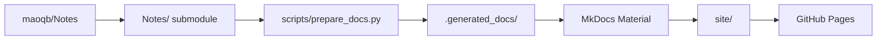

# Android Framework

Android / AOSP Framework 技术笔记站点。博客实现保存在本仓库，文章内容由独立的 [maoqb/Notes](https://github.com/maoqb/Notes) 仓库维护。

## 在线预览

在线站点：[https://maoqb.github.io/aosp-docs/](https://maoqb.github.io/aosp-docs/)

## 当前笔记

文章清单不在博客仓库中手工维护；站点会根据 [maoqb/Notes](https://github.com/maoqb/Notes) 的当前内容自动生成首页和导航。

## 网站构建架构

`Notes/` 是指向 [maoqb/Notes](https://github.com/maoqb/Notes) 的 Git submodule，本仓库只记录所使用的笔记版本，不再保存文章文件。构建时，准备脚本会直接解析 Markdown、DrawDoc、HTML 及其静态资源，按原目录结构写入临时目录，并根据 `Notes/` 自动生成首页文章列表和左上角菜单，再由 MkDocs Material 生成站点：



`mkdocs.yml` 不维护固定的 `nav`，新增 Markdown 或 `.drawdoc` 后会自动按文件目录层级出现在导航中。`.drawdoc` 会在构建时映射成站点页面，并渲染 Mermaid、draw.io、Excalidraw、mindmap、活目录和图片宽度约定。同名 `.drawdoc` 与 `.md` 并存时以 `.drawdoc` 为准，因此不再需要手工导出 Markdown。HTML 文件不会被转换，会以原路径复制到最终站点，因此同目录下的相对 CSS、JavaScript 和图片链接仍然有效。

## 本地运行

首次克隆本仓库时需要同时初始化笔记子模块：

```bash
git clone --recurse-submodules git@github.com:maoqb/aosp-docs.git
```

如果已经克隆了本仓库，则执行：

```bash
git submodule update --init --recursive
```

然后安装依赖并启动本地服务：

```bash
pip install -r requirements.txt
make serve
```

然后访问 <http://127.0.0.1:8000>。

也可以使用以下命令：

```bash
make build  # 严格模式构建到 site/
make clean  # 删除 .generated_docs/ 和 site/
```

## 更新笔记

笔记应在 `maoqb/Notes` 仓库中提交并推送。Notes 的 GitHub Actions 会自动更新本仓库的 submodule 指针，并触发博客构建和部署，无需手动提交博客仓库。

```bash
git -C Notes add .
git -C Notes commit -m "Update notes"
git -C Notes push
```

## 部署方式

推送到默认分支 `main` 后，GitHub Actions 会自动检出 `Notes` submodule、准备文档、构建站点并部署到 GitHub Pages。也可以在仓库的 Actions 页面手动触发 `Deploy documentation` 工作流。
